# Overview
This workflow demonstrates an example of performing robust and relatively fast camera alignment (SfM) using omnidirectional images: Equirectangular (equidistant cylindrical projection) images, followed by training 3D Gaussian Splatting (3DGS).

# References
### DJI AVATA360 examples
* https://x.com/naribubu/status/2038881884558791088
* https://x.com/naribubu/status/2038875398717722743
### DJI OSMO360 examples
* https://x.com/naribubu/status/2038646975894302792
* https://x.com/naribubu/status/2034937726756430125
* https://x.com/naribubu/status/2020138127084695876
* https://x.com/naribubu/status/2017883648075391214 (As for --yaw-offset option)

# Requirements
* 360° Camera
    * DJI OSMO360
    * DJI AVATA360
    * Insta360

* High-end PC and NVIDIA GPU
    * Training 3DGS requires a high-performance GPU. In particular, more VRAM is better. I recommend a GPU with at least 12 GB of VRAM.

* Metashape Standard
    * Directly supports SfM with omnidirectional images; extremely fast and robust.
    * https://www.agisoft.com/features/standard-edition/

* 3D Gaussian Splatting software
    * Postshot: https://www.jawset.com/
    * LichtFeld Studio (LFS): https://github.com/MrNeRF/LichtFeld-Studio
    * Brush: https://github.com/ArthurBrussee/brush
* Still-image extraction tool from video
    * Extract Sharpest Frame
        * https://github.com/Kotohibi/Extract_sharpest_frame
    * BOOTH Windows Binary Edition: https://kotohibi-cg.booth.pm/
* Metashape 360 SfM to COLMAP-format Cubemap conversion tool
    * Metashape 360 to COLMAP Converter
        * https://github.com/Kotohibi/Metashape_360_to_COLMAP_plane
    * BOOTH Windows Binary Edition: https://kotohibi-cg.booth.pm/

# Video Shooting (e.g. OSMO360)
Attach the camera to a selfie stick and slowly walk through the area you want to capture.  
Recommended video settings: D-Log M, 30 fps or higher.

# Develop the Video
### Import the captured data into DJI Studio and perform color grading (color restoration).  
* Apply the settings inside the red frame in the image below. Everything else can be left at default.  

### Export the video  
* Export as an MP4 omnidirectional video. Example settings are shown in the image below.  

# Extract Still Images from Video
There are many ways to extract still images from video. Research and choose your preferred method.  
Here I introduce the tool I have published.  
**Extract Sharpest Frame** is a tool that extracts the sharpest image at specified frame intervals.  
* **New features are prioritized for updates in the BOOTH edition**  
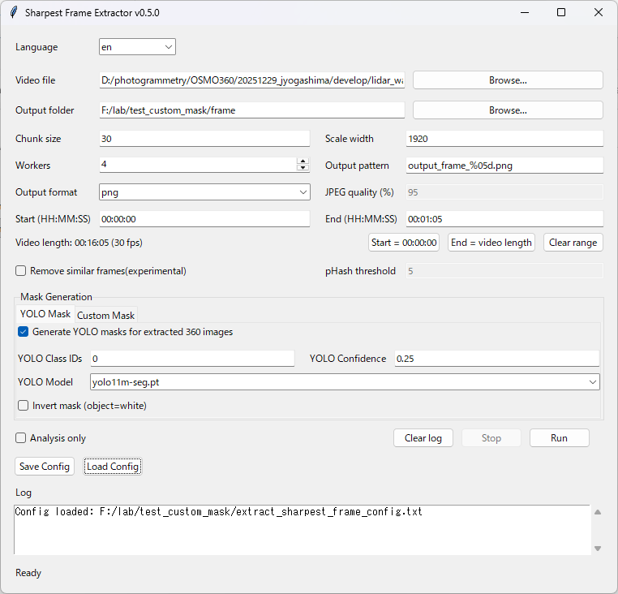

| Main Item          | Description |
|--------------------|-------------|
| Video file         | Select the omnidirectional video. <small>Note: File paths containing multibyte characters are not supported.</small> |
| Output folder      | Specify the folder where still images and masks will be saved. `frames` and `masks` folders will be created under this folder. <small>Note: File paths containing multibyte characters are not supported.</small> |
| Scale width        | Image size used when calculating sharpness for all video frames. Larger values give more precise calculations. Note: Extracted images are always output at the original video resolution. |
| Chunk size         | Interval for extracting still images. For a 30 fps video, setting 30 extracts images every 1 second. |
| Workers            | Number of processes used when calculating image sharpness. Around 4 is recommended. |
| Start (HH:MM:SS)   | Specify the time to start extraction. The format is HH:MM:SS. <small>If left blank, processing starts from the beginning of the video.</small> |
| End (HH:MM:SS)     | Specify the time to end extraction. The format is HH:MM:SS. <small>If left blank, processing continues to the end of the video.</small> |
| Remove similar frames | Excludes similar frames. |
| pHash threshold    | Specifies the threshold for judging similar frames. Higher values remove more images. This is useful when movement speed during shooting is irregular. |
| Mask Generation    | Generates mask images for moving objects such as people and cars. This improves SfM accuracy in later steps. |
| YOLO Class IDs     | Specify the object IDs you want to detect. 0: person, 1: bicycle, 2: car, etc. Various moving objects can be specified. https://github.com/ultralytics/ultralytics/blob/main/ultralytics/cfg/datasets/coco.yaml |
| YOLO Confidence    | Lowering the threshold increases detection rate but also increases noise. |
| Custom Mask        | Specify a fixed mask image. If used together with YOLO automatic masking, they are merged. This is useful for masking areas that are always visible, such as a camera rig. <small>Note: Specify a PNG image with the same resolution as the video.</small> 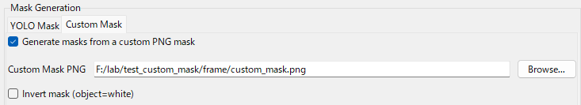 |
| Analysis only      | Perform only sharpness calculation. Calculation results (metadata) are saved in the output folder. On subsequent runs, if metadata exists in the output folder, the analysis phase is skipped and only image extraction is performed. Useful when adjusting Chunk size. |
| Save config        | Save the above settings as a configuration file. |
| Load config        | Load a previously saved configuration file. |
| Run                | Execute processing |

### Execution Result
* Still images are extracted as shown below. Please check the SfM result in the next step and readjust the Chunk size if necessary.  

* **Masks are also generated automatically**
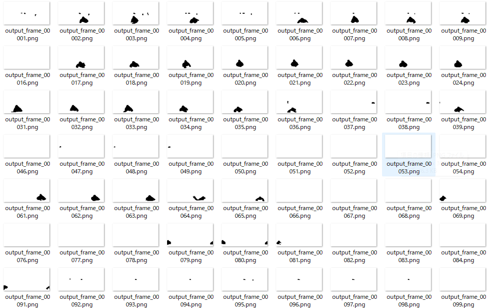

# Perform Camera Alignment (SfM)
Use Metashape Standard, which can directly process omnidirectional images for SfM.  
### Load the extracted omnidirectional images  
[Workflow] → [Add Folder]  

### Change Camera Type to Spherical  
Select [Tools] → [Camera Calibration] and set Camera type to Spherical.  

### Load the mask images
Select [File] → [Import] → [Import Masks].
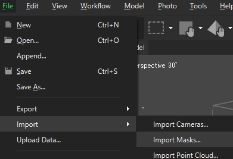
Use the settings below and click [OK]. Then a folder selection dialog will appear; select the mask folder generated by Extract Sharpest Frame.
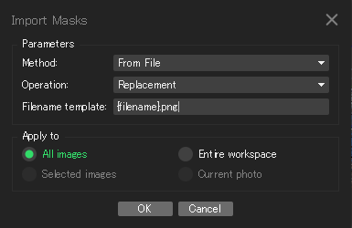
### Set SfM parameters  
[Workflow] → [Align Photos]  
Here is an example of parameters I often use.  
Select [**Key points**] for [**Apply masks to**].
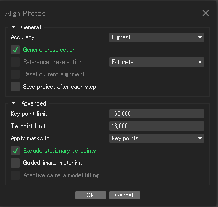
### Execute  
Click OK to run SfM.  
Example result shown below. The spherical markers correspond to each omnidirectional image.  

### Clean up Tie points
* Remove low-reliability Tie points to improve SfM accuracy.
This is a very important step for high-detail 3DGS.
Select [Tools] → [Tie Points] → [Clean Tie points].
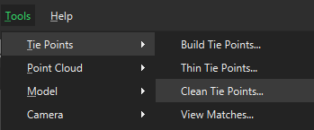

* Select [Reprojection error] and adjust the slider to remove about 5% of the Tie points.
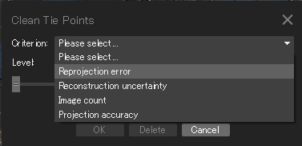

* The number of Tie points is shown at the bottom left of the screen, so adjust the slider while checking how many Tie points will be removed.
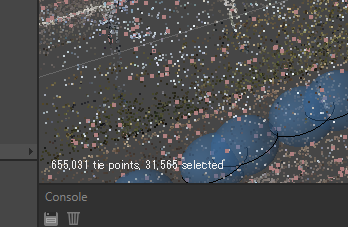

* Click [Optimize Cameras] to optimize the cameras.
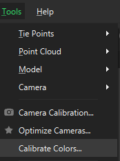

* Do the same for [Recostruction uncertainty], remove about 5% of the Tie points, and then run [Optimize Cameras] again.

* Do the same for [Projection accuracy], remove about 5% of the Tie points, and then run [Optimize Cameras] again.

* Repeat the above once more so that low-reliability Tie points are removed as much as possible.

### Export SfM results
    * Export Camera information  
      [File] → [Export] → [Export Cameras] → Select Agisoft XML (*.xml) and save.
    * Export Point Cloud  
      [File] → [Export] → [Export Point Cloud] → Select Stanford PLY (*.ply) and save.

# Convert to COLMAP Cubemap
Convert the Metashape SfM results into COLMAP-format 6-direction Cubemap images.  
Here I introduce the tool I have published.  
**Metashape 360 to COLMAP Converter**  
* **New features are prioritized for updates in the BOOTH edition**  
### Settings ①  

| Main Item          | Description |
|--------------------|-------------|
| Input Images Folder| Specify the folder containing the extracted omnidirectional images. <small>Note: File paths containing multibyte characters are not supported.</small> |
| Metashape XML      | Specify the Camera.xml from the SfM results. <small>Note: File paths containing multibyte characters are not supported.</small> |
| PLY File           | Specify the point_cloud.ply from the SfM results. <small>Note: File paths containing multibyte characters are not supported.</small> |
| Output Folder      | Specify the folder where the Cubemap will be saved. <small>Note: File paths containing multibyte characters are not supported.</small> |
| Crop Size          | Pixel size for the 6-direction crop. For OSMO360 8K video, 1920 is fine. |
| FoV                | Field of view for the 6-direction crop. 90° is fine. |
| Max Images         | Upper limit on the number of omnidirectional images to process. Use a small value when testing. |
| Image Range        | Specify a range of omnidirectional images to process (useful for partial processing). |
| Workers            | Number of processing threads. Adjust according to the number of CPU cores. |
| Yaw Offset         | Add variation to the Cubemap Yaw angle. The specified angle is added to each Cubemap. 5–30° is recommended. |
| Save Config        | Save the above settings as a config file |
| Run Conversion     | Start the Cubemap conversion process |

### Settings ②  
* You can mask moving objects such as people or vehicles.  
* Especially important for 360° cameras because the operator is often captured in the frame. Mask generation is a critical step.  

* **The settings below are explained in the BOOTH edition. The GitHub version has fewer features.**  

| Main Item             | Description |
|-----------------------|-------------|
| Mask Pass Mode        | Single: Detects moving objects only from the omnidirectional image (fast but lower accuracy). Dual: Uses both omnidirectional and Cubemap images (more processing but higher accuracy). |
| Merge Mode            | Mode used when combining masks in Dual mode. "union" simply merges both; "refine" uses the Cubemap mask as the base and integrates the omnidirectional mask. "refine" is recommended. |
| YOLO Class IDs        | Specify detected object IDs. 0: person, 1: bicycle, 2: car, etc. You can specify various moving objects. https://github.com/ultralytics/ultralytics/blob/main/ultralytics/cfg/datasets/coco.yaml |
| YOLO Confidence       | Lowering the threshold increases detection rate but also increases noise. |
| Enable overexposure mask | Overexposed (blown-out) pixels can become noise during 3DGS training. Enable this if you want to remove them. |

### Execute  
After processing completes successfully, the following folders and files are generated in the output folder.  

# (Postshot) 3D Gaussian Splatting Training
Here I explain the workflow using Postshot.

### Import Cubemap

* First, drag & drop the Images folder, cameras.txt, images.txt, and points3D.txt into Postshot.

### Mask Settings

* Next, drag & drop the masks folder into the Image Masks area in Postshot.  
Select **Remove Background** for Mask Mode.

### Cubemap Import Result

* Once the Cubemap is successfully imported, you will see a screen like the one above.

### Start 3DGS Training

* Here is an example of training parameters I use for wide-area 3DGS. Adjust parameters according to your scene.

### 3DGS Training Result

* As training progresses, you should start seeing the 3DGS!

# (LichtFeld Studio) 3D Gaussian Splatting Training
Here I explain the workflow using LichtFeld Studio (LFS).

### Import Cubemap
* Select [File] → [Import Dataset], then specify the `Output Folder` from Metashape 360 to COLMAP Converter.
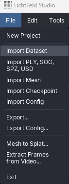

* If the data is detected correctly, a dialog like the one below appears. Confirm the contents and click [Load] to continue.
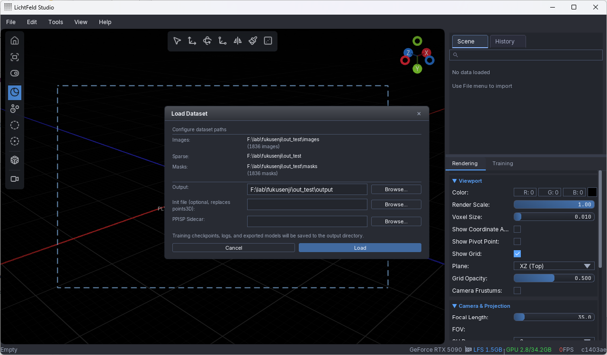

* Once the data is loaded correctly, you will see a screen like the one below.
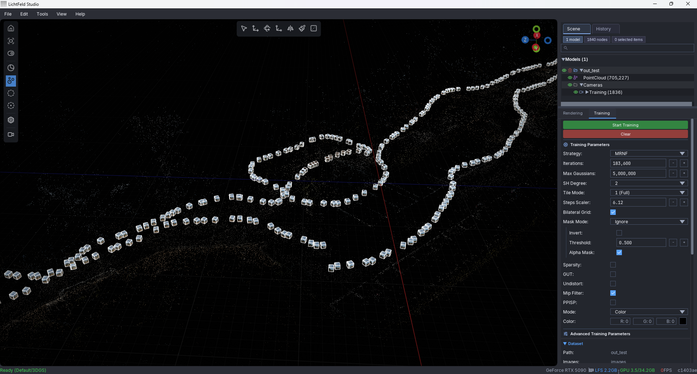

### Start 3DGS Training
* Mask settings
    * Select [Training Parameters] → [Mask Mode] → [Ignore].
* Training parameters
    * Here is an example of settings I often use.
    * I recommend [Strategy] → [MRNF] (at the time this article was written).
    * Adjust `Max Gaussians` according to the scale of the scene (3,000,000-12,000,000).
    * Adjust `SH Degree` (1-3). If VRAM is limited, I recommend 1.
    * With MRNF, changes to the other parameters are usually not very necessary.
    * LFS has many parameters, so please research on the web and find the best settings for your scene.
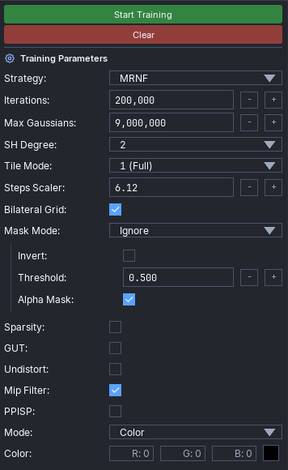

* Click [Start Training] to begin 3DGS training.

### 3DGS Training Result
* As training progresses, you should start seeing the 3DGS!
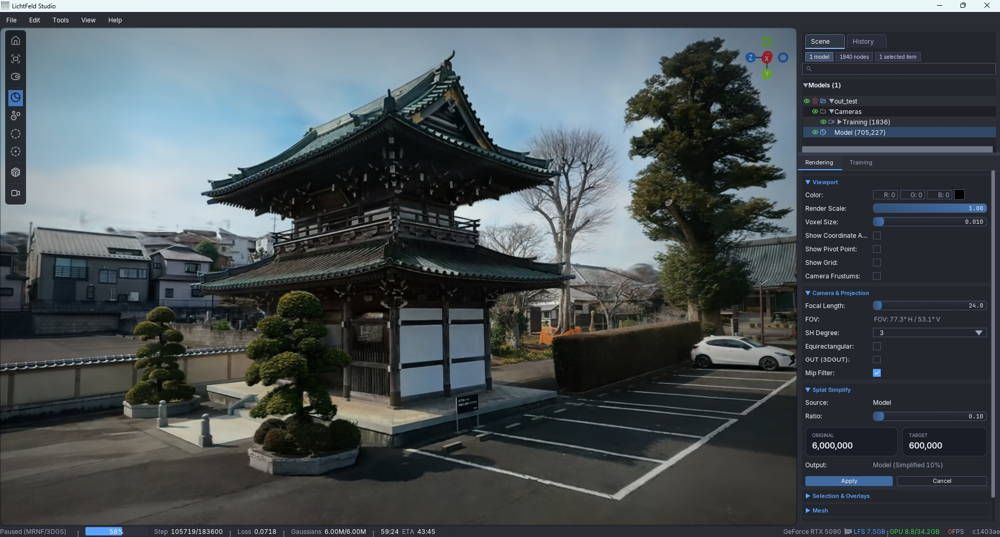

# Finally
There are many 3DGS methods, and this article is just one example. I will continue sharing the latest information on my X account.  
Please research on your own and develop even better techniques. Enjoy 3DGS :)  
* my X: https://x.com/kotohibi_3d